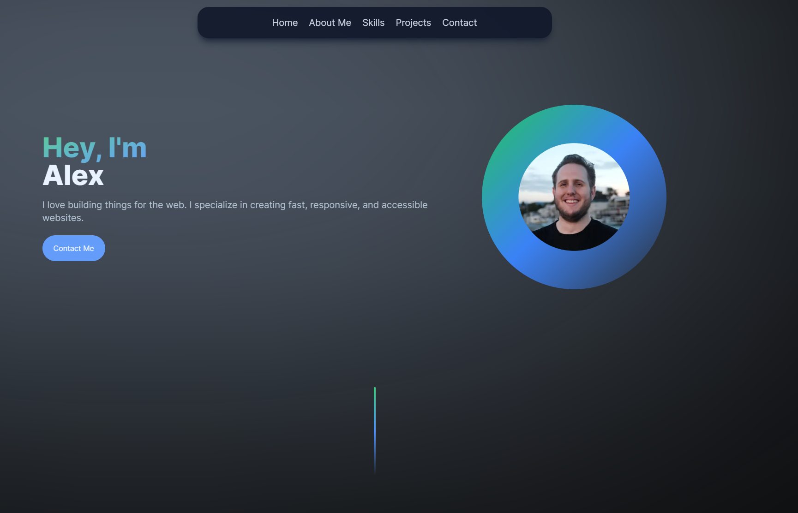

## Table of Contents
* [Intro](#general-info)
* [Technologies](#technologies)
* [Setup](#setup)
* [Learnings](#learnings)

## General Info
This is the repo for my portoflio website which can be found [here](https://alexellis.dev/). I'm planning on having it be a constantly evolving landscape that I can periodically revisit to add features and use as a [learning](#learnings) opportunity for some of those feature implementations. I'll also be using the website to host future projects that are in-progress and give individuals the ability to contact me. 

## Technologies
Project is Created With: 
* [React.js](https://reactjs.org/): A JavaScript library for building user interfaces.
* [Next.js](https://nextjs.org/): A React framework for production - it makes building fullstack React apps and sites a breeze and ships with built-in SSR.
* [TypeScript](https://www.typescriptlang.org/): A typed superset of JavaScript that compiles to plain JavaScript.
* [Tailwind CSS](https://tailwindcss.com/): A utility-first CSS framework for rapidly building custom designs. 
* [Vercel](https://vercel.com/): A cloud platform for static sites and Serverless Functions.
* [npm](https://www.npmjs.com/): A package manager for the JavaScript programming language.
* [Framer Motion](https://www.framer.com/api/motion/): A production-ready motion library for React. Utilize the power behind Framer, the best prototyping tool for teams. Proudly open source.

## Setup
To run this project, install it locally using npm:
~~~
$ cd ../portfolio-website
$ npm install
$ npm run dev
~~~

## Learnings
### Analysis Paralysis vs Bias Towards Action 
One of the first things I noticed is that I immediately wanted to sit down and scope out the entirety of the project and get an idea of what the best organization structure would be for each of the things that I wanted to implement. My worry was that I would spend too much time thinking about **how** to approach it that I would neglect **actually** approaching it and getting stuff done. For this particular project - I feel like I did a good job of opting for a bias towards action while also fighting scope creep. 

### Iterability
Looking back - I have a much better gauge on how to plan something for future interations and can see how the structure of a project greatly impacts the ability to add new features in the future. One specific example was the idea of implementing a "Dark Mode/Light Mode" toggle. In order to structure this implementation I would have benefited from having a directory specifically for current context of the page - this also would have empowered the ability to have conditional styling on things that would reduce time spent making updates. 

### "Deferred Maintenance"
For different parts of the project - styling, deciding on client components, state management - things really felt like an exmaple of deferred maintenance. I can either spending 15-30 minutes implementing a framework for future improvements or I can spend 60-120 minutes in the future tweaking a chain reaction of changes. 
